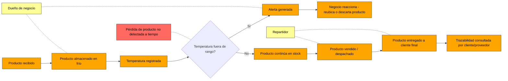
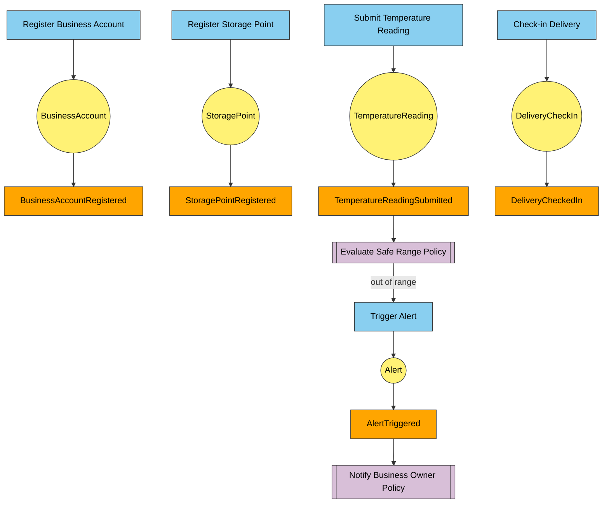
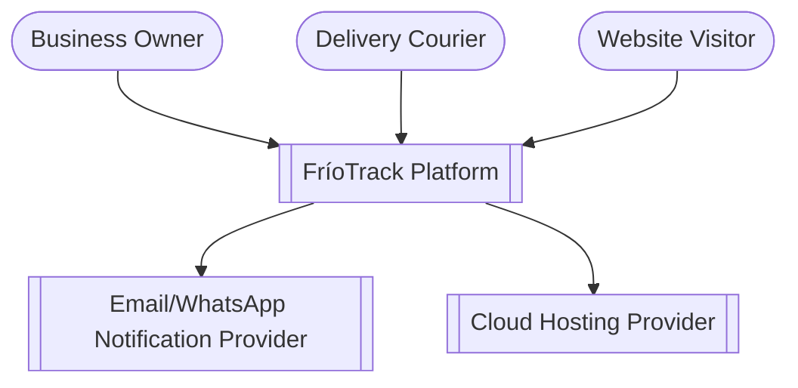
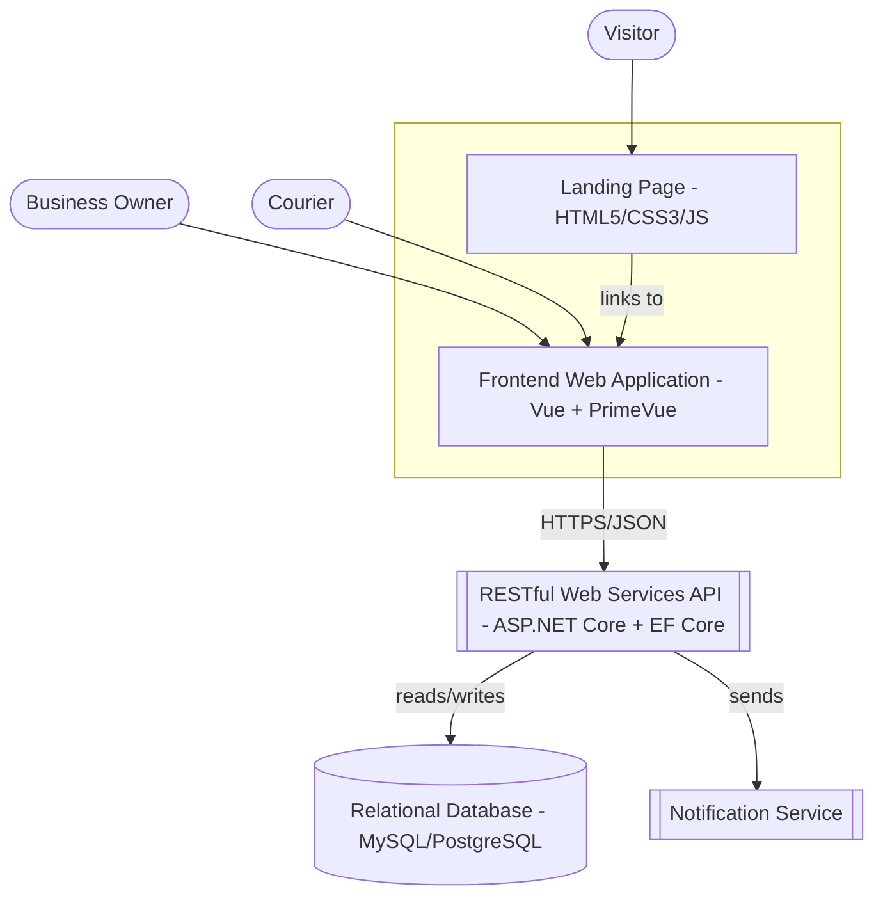
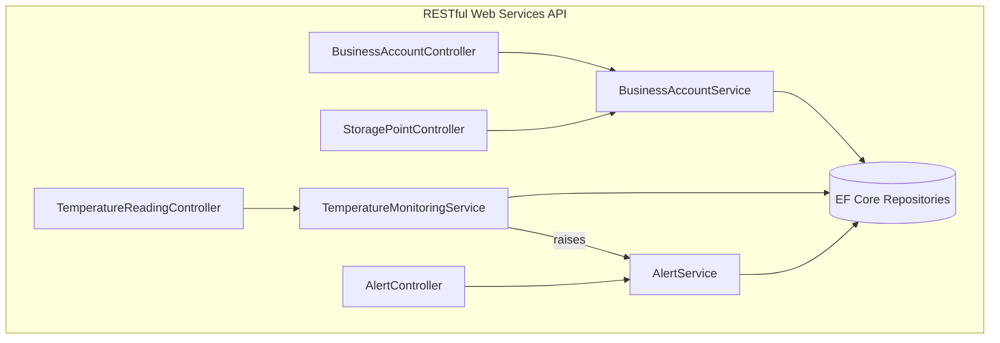
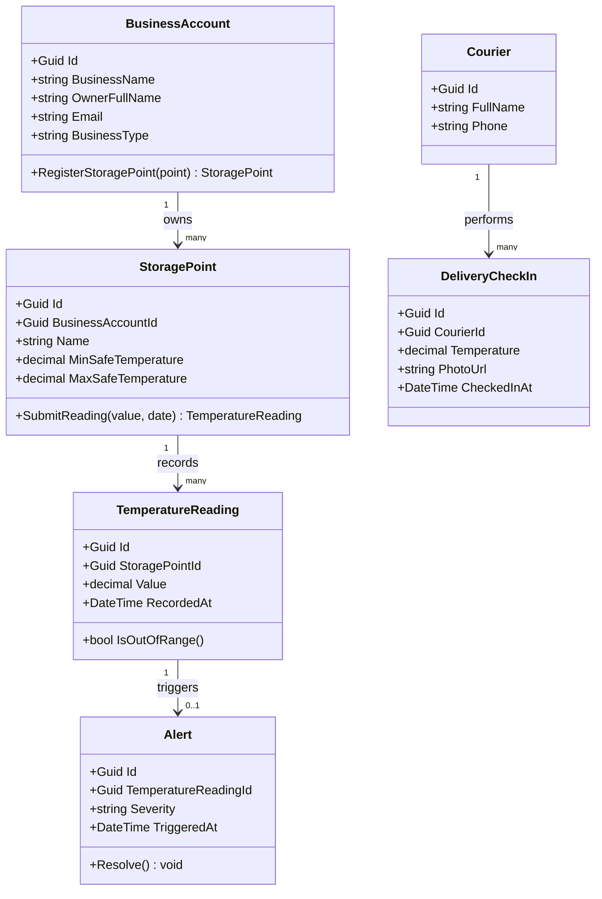
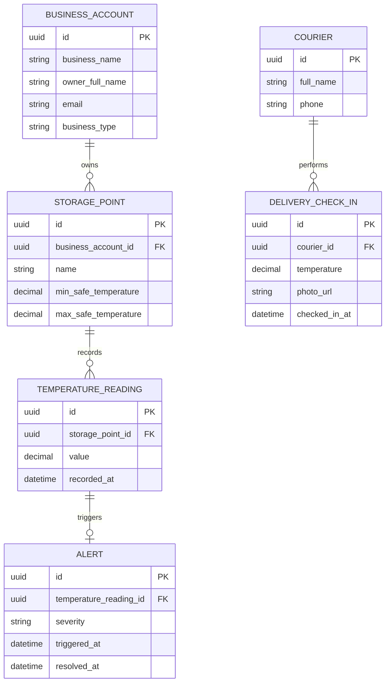

<div align="center">


<br>

Universidad Peruana de Ciencias Aplicadas  
Carrera de Ingeniería de Software  

<br>

### **1ASI0730**

### **Aplicaciones Web**

NRC

### **8088**

<br>

### **Informe del Trabajo Final**

Docente

### **Bautista Ubillús, Efrain Ricardo**

<br>

Equipo

### **BlackStartup**

Proyecto

### **FríoTrack**

<br>

### **Integrantes**

<br>

**Código** &nbsp;&nbsp;&nbsp;&nbsp;&nbsp;&nbsp;&nbsp;&nbsp; **Apellidos y Nombres**  
u20241f246 &nbsp;&nbsp;&nbsp;&nbsp; Atauje Barreto, Alexander Sebastián  
u202421137 &nbsp;&nbsp;&nbsp;&nbsp; Bardales Rodriguez, Benjamin Elias  
u202219829 &nbsp;&nbsp;&nbsp;&nbsp; Daga Chávez, Joaquín Leonardo  
u20241D811 &nbsp;&nbsp;&nbsp;&nbsp; Saavedra Flores, Rodrigo Andree  
u20231H17 &nbsp;&nbsp;&nbsp;&nbsp;&nbsp; Vera Solsol, Nayely Macarena  

<br>
<br>

### **Período 202620**

<br>

### **Septiembre 2026**

</div>

---

## Registro de Versiones del Informe

| Versión | Fecha | Autor | Descripción de modificación |
|---|---|---|---|
| V1.0 | 2026-09-01 | Atauje Barreto, Alexander Sebastián | Creación de carátula, tabla de contenidos y estructura base del informe (template). |
| V1.1 | 2026-09-16 | Bardales Rodriguez, Benjamin Elias | Borrador de contenido para **AV1** (Semana 4): Capítulo I al V (alcance de AV1), Student Outcome, Conclusiones preliminares, Bibliografía y Anexos. Pendiente de revisión y complementación por el resto del equipo (ver notas `[EQUIPO]` a lo largo del documento). |

> **Nota del equipo:** cada nueva entrega (AV1, TB1, AV2, TB2) debe agregar una fila nueva a este cuadro. No se debe sobrescribir el historial de versiones anteriores.

## Project Report Collaboration Insights

- **Repositorio del informe:** https://github.com/upc-pre-202620-1asi0730-8088-FrioTrack/report
- **AV1:** Este avance fue redactado inicialmente por Bardales Rodriguez, Benjamin Elias a partir de la carátula y estructura ya definidas por Atauje Barreto, Alexander Sebastián en la versión V1.0. `[EQUIPO: antes de entregar, cada integrante debe revisar/ajustar al menos una sección de su responsabilidad y hacer commit propio, para que el análisis de colaboración de GitHub (pestaña Insights > Contributors) muestre aportes de los 5 integrantes. Agregar aquí una captura de pantalla de dicho análisis antes de la entrega.]`

## Contenido

## Tabla de contenidos
* [Carátula](#universidad-peruana-de-ciencias-aplicadas)
* [Registro de Versiones del Informe](#registro-de-versiones-del-informe)
* [Project Report Collaboration Insights](#project-report-collaboration-insights)
* [Contenido](#contenido)
* [Student Outcome (SO5)](#student-outcome-so5)
* [Capítulo I: Introducción](#capítulo-i-introducción)
    - [1.1. Startup Profile](#11-startup-profile)
        - [1.1.1. Descripción de la Startup](#111-descripción-de-la-startup)
        - [1.1.2. Perfiles de integrantes del equipo](#112-perfiles-de-integrantes-del-equipo)
    - [1.2. Solution Profile](#12-solution-profile)
        - [1.2.1. Antecedentes y problemática](#121-antecedentes-y-problemática)
        - [1.2.2. Lean UX Process](#122-lean-ux-process)
            - [1.2.2.1. Lean UX Problem Statements](#1221-lean-ux-problem-statements)
            - [1.2.2.2. Lean UX Assumptions](#1222-lean-ux-assumptions)
            - [1.2.2.3. Lean UX Hypothesis Statements](#1223-lean-ux-hypothesis-statements)
            - [1.2.2.4. Lean UX Canvas](#1224-lean-ux-canvas)
    - [1.3. Segmentos objetivo](#13-segmentos-objetivo)
* [Capítulo II: Requirements Elicitation & Analysis](#capítulo-ii-requirements-elicitation--analysis)
    - [2.1. Competidores](#21-competidores)
        - [2.1.1. Análisis competitivo](#211-análisis-competitivo)
        - [2.1.2. Estrategias y tácticas frente a competidores](#212-estrategias-y-tácticas-frente-a-competidores)
    - [2.2. Entrevistas](#22-entrevistas)
        - [2.2.1. Diseño de entrevistas](#221-diseño-de-entrevistas)
        - [2.2.2. Registro de entrevistas](#222-registro-de-entrevistas)
        - [2.2.3. Análisis de entrevistas](#223-análisis-de-entrevistas)
    - [2.3. Needfinding](#23-needfinding)
        - [2.3.1. User Personas](#231-user-personas)
        - [2.3.2. User Task Matrix](#232-user-task-matrix)
        - [2.3.3. User Journey Mapping](#233-user-journey-mapping)
        - [2.3.4. Empathy Mapping](#234-empathy-mapping)
    - [2.4. Big Picture Event Storming](#24-big-picture-event-storming)
    - [2.5. Ubiquitous Language](#25-ubiquitous-language)
* [Capítulo III: Requirements Specification](#capítulo-iii-requirements-specification)
    - [3.1. User Stories](#31-user-stories)
    - [3.2. Impact Mapping](#32-impact-mapping)
    - [3.3. Product Backlog](#33-product-backlog)
* [Capítulo IV: Product Design](#capítulo-iv-product-design)
    - [4.1. Style Guidelines](#41-style-guidelines)
        - [4.1.1. General Style Guidelines](#411-general-style-guidelines)
        - [4.1.2. Web Style Guidelines](#412-web-style-guidelines)
    - [4.2. Information Architecture](#42-information-architecture)
        - [4.2.1. Organization Systems](#421-organization-systems)
        - [4.2.2. Labeling Systems](#422-labeling-systems)
        - [4.2.3. SEO Tags and Meta Tags](#423-seo-tags-and-meta-tags)
        - [4.2.4. Searching Systems](#424-searching-systems)
        - [4.2.5. Navigation Systems](#425-navigation-systems)
    - [4.3. Landing Page UI Design](#43-landing-page-ui-design)
        - [4.3.1. Landing Page Wireframe](#431-landing-page-wireframe)
        - [4.3.2. Landing Page Mock-up](#432-landing-page-mock-up)
    - [4.4. Web Applications UX/UI Design](#44-web-applications-uxui-design)
        - [4.4.1. Web Applications Wireframes](#441-web-applications-wireframes)
        - [4.4.2. Web Applications Wireflow Diagrams](#442-web-applications-wireflow-diagrams)
        - [4.4.3. Web Applications Mock-ups](#443-web-applications-mock-ups)
        - [4.4.4. Web Applications User Flow Diagrams](#444-web-applications-user-flow-diagrams)
    - [4.5. Web Applications Prototyping](#45-web-applications-prototyping)
    - [4.6. Domain-Driven Software Architecture](#46-domain-driven-software-architecture)
        - [4.6.1. Design-Level Event Storming](#461-design-level-event-storming)
        - [4.6.2. Software Architecture Context Diagram](#462-software-architecture-context-diagram)
        - [4.6.3. Software Architecture Container Diagrams](#463-software-architecture-container-diagrams)
        - [4.6.4. Software Architecture Components Diagrams](#464-software-architecture-components-diagrams)
    - [4.7. Software Object-Oriented Design](#47-software-object-oriented-design)
        - [4.7.1. Class Diagrams](#471-class-diagrams)
    - [4.8. Database Design](#48-database-design)
        - [4.8.1. Database Diagrams](#481-database-diagrams)
* [Capítulo V: Product Implementation, Validation & Deployment](#capítulo-v-product-implementation-validation--deployment)
    - [5.1. Software Configuration Management](#51-software-configuration-management)
        - [5.1.1. Software Development Environment Configuration](#511-software-development-environment-configuration)
        - [5.1.2. Source Code Management](#512-source-code-management)
        - [5.1.3. Source Code Style Guide & Conventions](#513-source-code-style-guide--conventions)
        - [5.1.4. Software Deployment Configuration](#514-software-deployment-configuration)
    - [5.2. Landing Page, Services & Applications Implementation](#52-landing-page-services--applications-implementation)
        - [5.2.1. Sprint 1](#521-sprint-1)
            - [5.2.1.1. Sprint Planning 1](#5211-sprint-planning-1)
            - [5.2.1.2. Aspect Leaders and Collaborators](#5212-aspect-leaders-and-collaborators)
            - [5.2.1.3. Sprint Backlog 1](#5213-sprint-backlog-1)
            - [5.2.1.4. Development Evidence for Sprint Review](#5214-development-evidence-for-sprint-review)
            - [5.2.1.5. Execution Evidence for Sprint Review](#5215-execution-evidence-for-sprint-review)
            - [5.2.1.6. Services Documentation Evidence for Sprint Review](#5216-services-documentation-evidence-for-sprint-review)
            - [5.2.1.7. Software Deployment Evidence for Sprint Review](#5217-software-deployment-evidence-for-sprint-review)
            - [5.2.1.8. Team Collaboration Insights during Sprint](#5218-team-collaboration-insights-during-sprint)
        - [5.2.2. Sprint 2](#522-sprint-2)
        - [5.2.3. Sprint 3](#523-sprint-3)
        - [5.2.4. Sprint 4](#524-sprint-4)
    - [5.3. Validation Interviews](#531-diseño-de-entrevistas)
        - [5.3.1. Diseño de Entrevistas](#531-diseño-de-entrevistas)
        - [5.3.2. Registro de Entrevistas](#532-registro-de-entrevistas)
        - [5.3.3. Evaluaciones según heurísticas](#533-evaluaciones-según-heurísticas)
    - [5.4. Video About-the-Product](#54-video-about-the-product)
* [Conclusiones y recomendaciones](#conclusiones-y-recomendaciones)
    - [Conclusiones](#conclusiones)
    - [Recomendaciones](#recomendaciones)
* [Video About-the-Team](#video-about-the-team)
* [Bibliografía](#bibliografía)
* [Anexos](#anexos)

---

# Student Outcome (SO5)

El curso contribuye al cumplimiento del Student Outcome ABET:
**ABET – EAC - Student Outcome 5**
Criterio: *La capacidad de funcionar efectivamente en un equipo cuyos miembros juntos proporcionan liderazgo, crean un entorno de colaboración e inclusivo, establecen objetivos, planifican tareas y cumplen objetivos*.
En el siguiente cuadro se describen las acciones realizadas y enunciados de conclusiones por parte del grupo, que permiten sustentar el haber alcanzado el logro del ABET – EAC - Student Outcome 5.

<div align="center">
  <table style="width:100%; border-collapse: collapse; font-family: Arial, sans-serif; font-size: 14px;">
    <thead>
      <tr style="background-color: #f2f2f2; text-align: center;">
        <th style="border: 1px solid #dddddd; padding: 12px; width: 25%;">Criterio específico</th>
        <th style="border: 1px solid #dddddd; padding: 12px; width: 45%;">Acciones realizadas</th>
        <th style="border: 1px solid #dddddd; padding: 12px; width: 30%;">Conclusiones</th>
      </tr>
    </thead>
    <tbody>
      <tr>
        <td style="border: 1px solid #dddddd; padding: 10px; font-weight: bold; vertical-align: top;">
          Trabaja en equipo para proporcionar liderazgo en forma conjunta.
        </td>
        <td style="border: 1px solid #dddddd; padding: 10px; vertical-align: top;">
          <ul>
            <li><b>AV1 - Atauje Barreto, Alexander Sebastián:</b> [EQUIPO: completar - lideró la creación de la carátula, estructura del repositorio y organización inicial del informe]</li>
            <li><b>AV1 - Bardales Rodriguez, Benjamin Elias:</b> [EQUIPO: completar - lideró la redacción del concepto de negocio, Lean UX, y coordinó el borrador de AV1]</li>
            <li><b>AV1 - Daga Chávez, Joaquín Leonardo:</b> [EQUIPO: completar]</li>
            <li><b>AV1 - Saavedra Flores, Rodrigo Andree:</b> [EQUIPO: completar]</li>
            <li><b>AV1 - Vera Solsol, Nayely Macarena:</b> [EQUIPO: completar]</li>
          </ul>
        </td>
        <td style="border: 1px solid #dddddd; padding: 10px; vertical-align: top;">
          [EQUIPO: redactar conclusión grupal sobre cómo se distribuyó el liderazgo durante AV1]
        </td>
      </tr>
      <tr>
        <td style="border: 1px solid #dddddd; padding: 10px; font-weight: bold; vertical-align: top;">
          Crea un entorno colaborativo e inclusivo, establece metas, planifica tareas y cumple objetivos.
        </td>
        <td style="border: 1px solid #dddddd; padding: 10px; vertical-align: top;">
          <ul>
            <li><b>AV1 - Atauje Barreto, Alexander Sebastián:</b> [EQUIPO: completar]</li>
            <li><b>AV1 - Bardales Rodriguez, Benjamin Elias:</b> [EQUIPO: completar]</li>
            <li><b>AV1 - Daga Chávez, Joaquín Leonardo:</b> [EQUIPO: completar]</li>
            <li><b>AV1 - Saavedra Flores, Rodrigo Andree:</b> [EQUIPO: completar]</li>
            <li><b>AV1 - Vera Solsol, Nayely Macarena:</b> [EQUIPO: completar]</li>
          </ul>
        </td>
        <td style="border: 1px solid #dddddd; padding: 10px; vertical-align: top;">
          [EQUIPO: redactar conclusión grupal sobre metas y planificación en el Sprint 1]
        </td>
      </tr>
    </tbody>
  </table>
</div>

> ⚠️ **Importante:** las celdas "Acciones realizadas" deben ser redactadas por cada integrante en primera persona describiendo lo que **él/ella** hizo realmente. Los textos anteriores son solo un esqueleto — reemplazar `[EQUIPO: completar]` por el aporte real de cada persona antes de entregar.

---

# Capítulo I: Introducción

## 1.1. Startup Profile

### 1.1.1. Descripción de la Startup

**BlackStartup** es el equipo de estudiantes de Ingeniería de Software de la UPC responsable del desarrollo de **FríoTrack**, una startup que propone un producto digital de monitoreo y trazabilidad de cadena de frío pensado para negocios pequeños y medianos que hoy no pueden pagar soluciones industriales de IoT.

Aplicando la técnica de las 5 W's y 2 H's:

| Pregunta | Respuesta |
|---|---|
| **Who** (¿Quién?) | Micro y pequeños negocios que manipulan productos perecederos (bodegas, minimarkets, restaurantes, farmacias/boticas) y los transportistas/repartidores que les distribuyen mercadería refrigerada, en Lima Metropolitana. |
| **What** (¿Qué?) | Ruptura no detectada de la cadena de frío durante el almacenamiento y transporte de última milla de alimentos y productos farmacéuticos perecederos. |
| **Where** (¿Dónde?) | Almacenes/cámaras frías pequeñas, vehículos de reparto no especializados (motos, autos, camionetas sin telemetría) y puntos de venta de negocios independientes en Lima. |
| **When** (¿Cuándo?) | Durante todo el ciclo de recepción, almacenamiento y distribución de productos perecederos, con mayor criticidad en las horas de transporte y en los cortes de energía eléctrica. |
| **Why** (¿Por qué?) | Perú pierde más del 33% de los alimentos que produce por mal manejo de la cadena de frío, cerca de 9 millones de toneladas al año (Escuela Peruana de Refrigeración / FAO), y ese porcentaje golpea de forma desproporcionada a negocios pequeños que no tienen sensores, personal dedicado ni presupuesto para plataformas industriales de monitoreo. |
| **How** (¿Cómo?) | Actualmente estos negocios controlan la temperatura de forma manual (termómetros sueltos, revisión visual, "al tacto"), sin registro digital ni alertas, por lo que las pérdidas se detectan cuando el producto ya se dañó. |
| **How much** (¿Cuánto?) | Las pérdidas por producto dañado y las devoluciones/reclamos de clientes representan un costo recurrente difícil de cuantificar para el propio negocio porque no llevan un registro sistemático — uno de los objetivos de FríoTrack es, precisamente, hacer visible ese costo. |

FríoTrack propone una plataforma web (Landing Page + Web Application) asequible y fácil de adoptar — sin exigir hardware industrial propietario — para que estos negocios registren, visualicen y reciban alertas sobre la temperatura de sus productos, y para que puedan demostrar a sus propios clientes (trazabilidad) que la cadena de frío se respetó.

`[EQUIPO: validar y ajustar esta descripción en la primera reunión de equipo — en particular, confirmar si el modelo de negocio incluye venta/alquiler de sensores IoT de bajo costo o si en esta primera versión el registro de temperatura es manual/semi-manual (fotos + digitación) apoyado por recordatorios. Esa decisión afecta el alcance técnico de los sprints siguientes.]`

### 1.1.2. Perfiles de integrantes del equipo

`[EQUIPO: cada integrante debe redactar su propio perfil (foto, código, carrera, y un párrafo resumiendo sus principales conocimientos técnicos y habilidades que aporta al equipo). No se debe inventar esta información por otra persona.]`

| Foto | Código | Nombre completo | Carrera | Resumen de conocimientos y habilidades |
|---|---|---|---|---|
| `[foto]` | u20241f246 | Atauje Barreto, Alexander Sebastián | Ingeniería de Software | `[EQUIPO: completar]` |
| `[foto]` | u202421137 | Bardales Rodriguez, Benjamin Elias | Ingeniería de Software | `[EQUIPO: completar]` |
| `[foto]` | u202219829 | Daga Chávez, Joaquín Leonardo | Ingeniería de Software | `[EQUIPO: completar]` |
| `[foto]` | u20241D811 | Saavedra Flores, Rodrigo Andree | Ingeniería de Software | `[EQUIPO: completar]` |
| `[foto]` | u20231H17 | Vera Solsol, Nayely Macarena | Ingeniería de Software | `[EQUIPO: completar]` |

## 1.2. Solution Profile

### 1.2.1. Antecedentes y problemática

Según la FAO, más de 12 millones de toneladas de alimentos se pierden a lo largo de la cadena productiva en el Perú, y la Escuela Peruana de Refrigeración estima que más del 33% de esa pérdida (cerca de 9 millones de toneladas anuales) se debe a un mal manejo de la cadena de frío. A nivel regional, América Latina y el Caribe concentra 1 de cada 5 pérdidas de alimentos del mundo.

Las soluciones existentes de monitoreo de cadena de frío (ver Capítulo II, sección 2.1 Competidores) están diseñadas para operadores logísticos de gran escala — flotas de camiones refrigerados, cadenas de supermercados, farmacéuticas — con contratos, hardware propietario y precios pensados para ese volumen. El segmento de micro y pequeños negocios (bodegas, minimarkets, restaurantes, farmacias independientes) queda fuera de ese mercado: siguen controlando la temperatura "a ojo", sin registro histórico ni alertas, por lo que descubren el problema cuando el producto ya se echó a perder.

Objetivos de la solución:
1. Dar visibilidad simple y económica del estado de la cadena de frío a negocios que hoy no tienen ninguna.
2. Generar un registro histórico y trazable que el negocio pueda mostrar a sus propios clientes o proveedores como evidencia de buenas prácticas.
3. Alertar tempranamente ante una posible ruptura de cadena de frío, antes de que el producto se dañe.

Restricciones que delimitan el alcance:
- La primera versión del producto (Sprint 1, AV1) se limita al Landing Page informativo/comercial; el registro de temperatura y las alertas son funcionalidades de la Web Application, a desarrollarse en sprints posteriores (TB1 en adelante).
- El equipo no fabricará hardware propio (sensores IoT); se evaluará en sprints posteriores si se integra con sensores de bajo costo existentes en el mercado o si la primera versión funcional se apoya en registro manual asistido (fotos + digitación + recordatorios).
- El idioma por defecto de la interfaz y documentación es inglés (según lo exigido por el enunciado del curso), con español como alternativa vía i18n.

### 1.2.2. Lean UX Process

#### 1.2.2.1. Lean UX Problem Statements

> *The current state of* **cold-chain monitoring for micro and small perishable-goods businesses** *has focused mainly on* **large fleets, supermarket chains and pharmaceutical distributors that can afford industrial IoT platforms and dedicated logistics staff**.
> *What existing products/services fail to address is* **an affordable, simple way for a small bodega, restaurant or pharmacy to know — and prove — that their refrigerated products never left the safe temperature range**.
> *Our product/service will address this gap by* **offering a lightweight, low-cost web platform that lets small businesses log, visualize and get alerted about cold-chain conditions without industrial hardware or long-term contracts**.
> *Our initial focus will be* **independent food and pharmacy micro-businesses in Lima Metropolitana that handle perishable products daily and their last-mile delivery couriers**.
> *We'll know we are successful when we see* **these businesses actively checking their FríoTrack dashboard, reporting incidents through it, and reducing the perishable-product losses they can now, for the first time, actually measure**.

#### 1.2.2.2. Lean UX Assumptions

`[EQUIPO: estos supuestos deben discutirse y ajustarse en equipo — son un punto de partida, no una verdad validada.]`

**Business Assumptions**
- Existe un mercado desatendido de micro y pequeños negocios de perecederos dispuestos a pagar una suscripción mensual baja por visibilidad de su cadena de frío.
- Es posible diferenciarse de competidores industriales (Ztrack, RedGPS, Zonar) enfocándose en simplicidad y precio, no en cobertura de flotas grandes.
- El modelo de negocio puede sostenerse con una suscripción SaaS mensual por negocio (freemium o plan único de bajo costo).

**Business Outcome Assumptions**
- Reducir en al menos 20% las pérdidas reportadas de producto por descontrol de temperatura en los negocios que usan FríoTrack de forma constante durante 3 meses.
- Lograr que el 60% de los negocios que se registran generen al menos un reporte de temperatura por semana.

**User Assumptions**
- El dueño/administrador de una bodega, minimarket, restaurante o farmacia pequeña es quien decide adoptar una herramienta digital de este tipo.
- Los repartidores/transportistas de última milla están dispuestos a registrar la temperatura al momento de la entrega si el proceso toma menos de un minuto.

**User Outcome and Benefit Assumptions**
- Los dueños de negocio quieren evitar pérdidas económicas por producto dañado y quieren poder demostrar a sus clientes que su cadena de frío es confiable.
- Los repartidores quieren un proceso de registro simple que no les quite tiempo en cada entrega.

**Feature Assumptions**
- Un dashboard simple de temperatura por punto de almacenamiento resolverá la necesidad de visibilidad del dueño del negocio.
- Un formulario rápido de registro (con opción de foto) al momento de la entrega será suficiente para que el repartidor documente la condición del producto.
- Alertas automáticas por WhatsApp/correo cuando la temperatura registrada sale de rango serán suficientes para que el negocio actúe a tiempo.

#### 1.2.2.3. Lean UX Hypothesis Statements

*(una hipótesis por cada feature assumption, siguiendo el template "We believe we will achieve... If... Attain... With...")*

**H1 — Dashboard de temperatura**
We believe we will achieve **una reducción medible de pérdidas por producto dañado**
If **dueños de bodegas, minimarkets, restaurantes y farmacias pequeñas**
Attain **visibilidad diaria y clara del estado de la cadena de frío de sus productos**
With **un dashboard web simple que muestre las últimas lecturas de temperatura por punto de almacenamiento y su estado (normal / en riesgo / crítico)**.

**H2 — Registro rápido en el punto de entrega**
We believe we will achieve **mayor cantidad y calidad de datos de trazabilidad**
If **repartidores/transportistas de última milla**
Attain **la posibilidad de documentar en segundos la condición del producto que entregan**
With **un formulario móvil de registro rápido (temperatura + foto opcional) integrado a su flujo de entrega**.

**H3 — Alertas tempranas**
We believe we will achieve **una reacción a tiempo ante posibles rupturas de cadena de frío**
If **dueños de negocio**
Attain **una notificación inmediata cuando una lectura sale de rango seguro**
With **alertas automáticas por correo/WhatsApp configurables por tipo de producto**.

#### 1.2.2.4. Lean UX Canvas

| Elemento | Contenido |
|---|---|
| 1. Business Problem | Los negocios pequeños que manejan productos perecederos pierden dinero por rupturas de cadena de frío que no pueden detectar a tiempo, mientras las plataformas de monitoreo existentes están diseñadas y priceadas para operadores grandes. |
| 2. Business Outcomes | Reducir pérdidas de producto perecedero en los negocios usuarios; generar ingresos recurrentes vía suscripción SaaS de bajo costo. |
| 3. Users & Customers | Dueños/administradores de bodegas, minimarkets, restaurantes y farmacias pequeñas (customer + user); repartidores de última milla (user). |
| 4. User Outcomes & Benefits | Menos pérdidas económicas; evidencia/trazabilidad para mostrar a sus propios clientes; tranquilidad de saber que el producto llegó en condiciones seguras. |
| 5. Solutions | Landing Page comercial + Web Application con dashboard de temperatura, registro rápido en entrega y alertas automáticas. |
| 6. Hypotheses | H1, H2, H3 (ver 1.2.2.3). |
| 7. What's the most important thing we need to learn first? | Si los dueños de negocio pequeños realmente perciben las pérdidas por cadena de frío como un problema prioritario (vs. otros problemas operativos) y estarían dispuestos a pagar por resolverlo. |
| 8. What's the least amount of work we need to do to learn the next most important thing? | Entrevistas de validación con 3-5 dueños de negocio por segmento (ver 2.2 Entrevistas) antes de invertir en desarrollo del dashboard completo. |

## 1.3. Segmentos objetivo

**Segmento 1 — Dueño/administrador de negocio de perecederos ("Cold-Chain Business Owner")**
Bodegas, minimarkets, restaurantes y farmacias/boticas independientes de Lima Metropolitana que almacenan y venden productos que requieren refrigeración (lácteos, cárnicos, congelados, medicamentos que requieren cadena de frío). Suelen ser negocios de 1 a 10 trabajadores, con un dueño que también opera el día a día. Es el segmento con mayor exposición económica directa a la ruptura de cadena de frío.

**Segmento 2 — Transportista/repartidor de última milla ("Cold-Chain Courier")**
Personas que transportan productos perecederos desde el proveedor/distribuidor hasta el negocio, o desde el negocio hasta el cliente final (delivery), generalmente en vehículos sin telemetría (motos, autos particulares, camionetas pequeñas). Son quienes están físicamente presentes en el momento de mayor riesgo de ruptura de cadena de frío (el transporte).

`[EQUIPO: sustento estadístico/demográfico adicional (edad, distrito, tamaño de negocio) debe completarse a partir de las entrevistas reales — ver 2.2.2 Registro de entrevistas. Los datos de esta sección son un punto de partida cualitativo, no una encuesta.]`

---

# Capítulo II: Requirements Elicitation & Analysis

## 2.1. Competidores

### 2.1.1. Análisis competitivo

Se identificaron tres competidores indirectos, todos orientados a operaciones de gran escala — ninguno compite directamente por el segmento de micro/pequeños negocios, lo que sustenta el gap de mercado de FríoTrack.

| | Su Startup (FríoTrack) | Competidor 1: Ztrack (Perú) | Competidor 2: RedGPS ONTracking Cold Chain | Competidor 3: Zonar Systems |
|---|---|---|---|---|
| **Overview** | Plataforma web ligera de monitoreo y trazabilidad de cadena de frío para micro/pequeños negocios. | Plataforma IoT de telemetría para equipos frigoríficos industriales en Perú. | Plataforma de certificación y monitoreo de cadena de frío para transporte de carga. | Sistema de sensores + software para flotas de transporte refrigerado. |
| **Ventaja competitiva** | Precio accesible, adopción sin hardware industrial, foco en negocios pequeños. | Telemetría en tiempo real, alertas por WhatsApp, control remoto de setpoints. | Certificación descargable con más de 70 reglas de cumplimiento. | Hasta 4 sensores por remolque, alertas automáticas por correo. |
| **Mercado objetivo** | Bodegas, minimarkets, restaurantes, farmacias pequeñas y sus repartidores. | Operadores de flotas, distribuidoras con cámaras frías, plantas industriales. | Transportistas de carga refrigerada, supermercados, farmacéuticas. | Empresas de transporte de alimentos/farmacéuticos con flotas de 1 a 100+ vehículos. |
| **Productos y servicios** | Landing Page + Web App (dashboard, registro rápido, alertas). | App móvil/web, telemetría GPS, control remoto de equipos. | Certificados de carga, reglas de condicionamiento personalizables. | Sensores de temperatura, software de monitoreo web. |
| **Precios y costos** | A definir — suscripción SaaS mensual de bajo costo (por validar con segmento). | No publicado; orientado a contrato corporativo. | No publicado; cotización por volumen de flota. | Cotización según cantidad de vehículos (1-10, 11-50, 51-100, 100+). |
| **Canales de distribución** | Web (Landing Page + Web App), redes sociales, referidos entre negocios del mismo rubro/mercado. | Venta directa/comercial B2B, cobertura nacional Perú. | Ecosistema WhiteLabel de RedGPS, venta B2B. | Venta directa B2B por volumen de flota. |

**Análisis SWOT (FríoTrack frente a competidores)**

| | Fortalezas | Debilidades |
|---|---|---|
| **FríoTrack** | Precio accesible; sin hardware industrial obligatorio; UX simple pensada para no-expertos; foco claro en un segmento desatendido. | Marca nueva sin reputación; sin capacidad de fabricar/certificar hardware propio; equipo estudiantil con recursos limitados. |
| | **Oportunidades** | **Amenazas** |
| | Alto volumen de pérdidas de alimentos en Perú (33%+) sin solución accesible para pequeños negocios; posible alianza con asociaciones de bodegueros/farmacias. | Competidores grandes podrían lanzar un plan "lite" para pequeños negocios; baja disposición a pagar de negocios muy pequeños; resistencia a la digitalización. |

### 2.1.2. Estrategias y tácticas frente a competidores

- **Frente a la fortaleza de Ztrack/RedGPS/Zonar en telemetría industrial:** no competir en ese terreno; posicionar FríoTrack como la opción "primero simple, después inteligente" — empezar con registro asistido y evolucionar hacia sensores de bajo costo solo si el segmento lo valida.
- **Frente a la debilidad de marca nueva:** apoyarse en las entrevistas y validaciones reales con negocios del propio entorno del equipo (ver 2.2) para construir casos de uso y testimonios desde el inicio.
- **Frente a la amenaza de un competidor grande lanzando un plan "lite":** priorizar velocidad de aprendizaje (Lean UX) y cercanía con el segmento (soporte en español, WhatsApp) como ventaja difícil de igualar para un jugador corporativo.

## 2.2. Entrevistas

### 2.2.1. Diseño de entrevistas

`[EQUIPO: esta sección debe completarse con las preguntas reales que usará el equipo — a continuación una propuesta de guion por segmento que deben revisar y ajustar antes de salir a entrevistar.]`

**Guion propuesto — Segmento 1 (Dueño/administrador de negocio)**
1. Cuéntame sobre tu negocio: ¿qué productos perecederos manejas y cómo los almacenas?
2. ¿Cómo controlas hoy la temperatura de tus productos? ¿Usas algún equipo o método en particular?
3. ¿Has tenido pérdidas de producto por temperatura (se dañó, venció antes, cliente reclamó)? Cuéntame la última vez que pasó.
4. ¿Cómo te enteraste de que el producto se había dañado? ¿A tiempo o después?
5. Si pudieras ver en tu celular el estado de temperatura de tu cámara/refrigeradora en cualquier momento, ¿lo revisarías? ¿Con qué frecuencia?
6. ¿Qué tan importante sería para ti poder mostrarle a un cliente o proveedor un registro de que el producto se mantuvo bien refrigerado?
7. ¿Pagarías una suscripción mensual pequeña por esto? ¿Cuánto te parecería razonable?

**Guion propuesto — Segmento 2 (Repartidor/transportista)**
1. Cuéntame cómo es tu rutina de reparto/transporte de productos que necesitan frío.
2. ¿Qué haces hoy para asegurarte de que el producto llega en buen estado?
3. ¿Alguna vez un cliente te reclamó porque el producto llegó en mal estado? ¿Qué pasó?
4. Si tuvieras que registrar la temperatura o tomar una foto del producto en cada entrega, ¿cuánto tiempo extra te tomaría que fuera aceptable?
5. ¿Usas alguna app o herramienta digital en tu trabajo actualmente? ¿Cuál?

### 2.2.2. Registro de entrevistas

`[EQUIPO: ⚠️ esta sección requiere entrevistas REALES a personas reales de cada segmento (3 a 5 por segmento), grabadas en video y subidas a Microsoft Stream, según el enunciado. No se debe inventar información de entrevistados — se debe completar después de realizar las entrevistas.]`

| Segmento | Nombre y apellido | Edad | Distrito | Video (URL Stream) | Duración | Resumen |
|---|---|---|---|---|---|---|
| 1 | `[EQUIPO: completar]` | | | | | |
| 1 | `[EQUIPO: completar]` | | | | | |
| 1 | `[EQUIPO: completar]` | | | | | |
| 2 | `[EQUIPO: completar]` | | | | | |
| 2 | `[EQUIPO: completar]` | | | | | |
| 2 | `[EQUIPO: completar]` | | | | | |

### 2.2.3. Análisis de entrevistas

`[EQUIPO: completar con estadísticas (porcentajes) reales una vez realizadas las entrevistas — esta sección depende directamente de 2.2.2.]`

## 2.3. Needfinding

> **Nota de herramienta:** el enunciado exige que User Personas, User Journey Maps e Impact Map se elaboren en **UXPressia**. Lo que sigue es un borrador de contenido en texto para que el equipo lo traslade a UXPressia una vez validado con las entrevistas reales (2.2.2), no un reemplazo del artefacto en la herramienta.

### 2.3.1. User Personas

**Persona borrador — Segmento 1: "Doña Rosa, dueña de bodega"**
`[EQUIPO: reemplazar por persona construida a partir de entrevistas reales]`
- Rol: dueña/administradora de una bodega/minimarket con refrigeradora para lácteos, embutidos y bebidas.
- Objetivo: no perder mercadería y mantener contentos a sus clientes habituales.
- Frustración: se entera de que un producto se dañó cuando ya lo tiene que botar o un cliente se lo devuelve.
- Nivel tecnológico: usa WhatsApp y apps de pago móvil (Yape/Plin) con soltura; no usa software de gestión.

**Persona borrador — Segmento 2: "Kevin, repartidor de última milla"**
`[EQUIPO: reemplazar por persona construida a partir de entrevistas reales]`
- Rol: reparte pedidos en moto para una distribuidora pequeña de productos refrigerados.
- Objetivo: hacer sus entregas rápido sin reclamos.
- Frustración: no tiene forma de "defenderse" cuando el cliente dice que el producto llegó mal, aunque él lo entregó bien.
- Nivel tecnológico: usa apps de mapas y mensajería a diario.

### 2.3.2. User Task Matrix

| Tarea | Doña Rosa (frecuencia / importancia) | Kevin (frecuencia / importancia) |
|---|---|---|
| Revisar temperatura de almacenamiento | Alta / Alta | Baja / Baja |
| Registrar condición del producto al recibirlo/entregarlo | Media / Alta | Alta / Alta |
| Recibir alerta ante temperatura fuera de rango | Alta / Alta | Media / Media |
| Mostrar historial de trazabilidad a un cliente/proveedor | Baja / Media | Baja / Baja |
| Configurar rangos de temperatura por producto | Baja / Media | No aplica |

`[EQUIPO: completar explicación resaltando tareas de mayor frecuencia/importancia una vez validado con entrevistas reales.]`

### 2.3.3. User Journey Mapping

`[EQUIPO: construir en UXPressia el As-Is Journey Map de Doña Rosa y de Kevin. Esqueleto propuesto para Doña Rosa:]`

1. **Recibe mercadería** → revisa "al tacto" si llegó fría → confía en el proveedor.
2. **Almacena en refrigeradora** → no hay forma de saber si la temperatura se mantiene estable durante el día.
3. **Vende el producto** → en general no hay incidentes.
4. **Detecta un problema** → nota mal olor/aspecto o recibe un reclamo → ya es tarde, el producto se pierde.
5. **Reacciona** → bota el producto, absorbe la pérdida, no sabe exactamente cuándo ni por qué falló la cadena de frío.

### 2.3.4. Empathy Mapping

`[EQUIPO: construir en la herramienta indicada. Borrador para Doña Rosa:]`

- **¿Qué piensa y siente?** Preocupación constante por perder mercadería; sensación de no tener control total sobre su refrigeradora.
- **¿Qué ve?** Su refrigeradora llena de distintos productos; competidores cercanos con más variedad; clientes que a veces devuelven producto.
- **¿Qué dice y hace?** Revisa "al tacto"; confía en la experiencia; pide a sus proveedores que "manden bien frío".
- **¿Qué escucha?** Comentarios de otros bodegueros sobre pérdidas similares; quejas ocasionales de clientes.
- **Pains:** perder dinero en producto dañado; no saber cuándo ni por qué pasó.
- **Gains:** tranquilidad de saber que su mercadería está bien; poder decirle a un cliente "esto se mantuvo bien refrigerado".

## 2.4. Big Picture Event Storming



`[EQUIPO: este diagrama es un punto de partida para la sesión colaborativa Big Picture EventStorming (idealmente presencial/virtual con post-its en FigJam o Miro, 1-2 horas). Debe completarse con captura de la sesión real del equipo y su explicación, siguiendo la guía https://bit.ly/bpes-guide.]`

## 2.5. Ubiquitous Language

| Term (English) | Término (Español) | Definición |
|---|---|---|
| Cold Chain | Cadena de frío | Secuencia ininterrumpida de almacenamiento y transporte de un producto dentro de un rango de temperatura seguro, desde su origen hasta el consumidor final. |
| Cold Chain Break | Ruptura de cadena de frío | Evento en el que la temperatura de un producto sale del rango seguro definido para ese producto. |
| Storage Point | Punto de almacenamiento | Ubicación física (refrigeradora, cámara fría, vitrina) donde un negocio guarda productos perecederos. |
| Temperature Reading | Lectura de temperatura | Registro puntual de temperatura asociado a un punto de almacenamiento o a una entrega, con fecha y hora. |
| Safe Range | Rango seguro | Intervalo de temperatura mínimo y máximo definido para un tipo de producto, dentro del cual se considera que no hay riesgo. |
| Alert | Alerta | Notificación automática generada cuando una lectura de temperatura sale del rango seguro. |
| Delivery Check-in | Registro de entrega | Registro que hace un repartidor al momento de entregar un producto, incluyendo temperatura y/o foto. |
| Business Account | Cuenta de negocio | Cuenta de un negocio (bodega, restaurante, farmacia) registrada en FríoTrack. |
| Traceability Report | Reporte de trazabilidad | Documento/vista que resume el historial de temperatura de un producto o lote, exportable para mostrar a terceros. |

---

# Capítulo III: Requirements Specification

## 3.1. User Stories

| Epic/Story ID | Título | Descripción | Criterios de Aceptación | Relacionado con (Epic ID) |
|---|---|---|---|---|
| E01 | Landing Page informativa | — | — | — |
| US01 | Conocer la propuesta de valor | Como visitante, deseo entender en pocos segundos qué hace FríoTrack para decidir si me interesa. | Given que soy un visitante nuevo, When entro al Landing Page, Then veo un encabezado claro con la propuesta de valor y un botón de llamado a la acción visible sin necesidad de hacer scroll. | E01 |
| US02 | Ver cómo funciona el producto | Como visitante, deseo ver los pasos principales de cómo funciona FríoTrack para entender el producto antes de registrarme. | Given que estoy en el Landing Page, When bajo a la sección "Cómo funciona", Then veo 3 pasos ilustrados del flujo de uso. | E01 |
| US03 | Ver planes/precio | Como visitante dueño de negocio, deseo ver el precio de FríoTrack para decidir si se ajusta a mi presupuesto. | Given que estoy en el Landing Page, When bajo a la sección de precios, Then veo el plan disponible con su costo mensual. | E01 |
| US04 | Registrar interés/contacto | Como visitante interesado, deseo dejar mis datos de contacto para que el equipo de FríoTrack me contacte. | Given que completo el formulario de contacto con datos válidos, When presiono "Enviar", Then veo un mensaje de confirmación. Given que dejo un campo obligatorio vacío, When presiono "Enviar", Then veo un mensaje de error indicando qué falta. | E01 |
| US05 | Navegar desde el Landing Page a la Web App | Como visitante del segmento dueño de negocio, deseo que el botón "Comenzar" me lleve a la vista de registro de la Web Application. | Given que estoy en el Landing Page, When presiono "Comenzar", Then soy redirigido a la vista de registro correspondiente a mi segmento. | E01 |
| E02 | Dashboard de temperatura *(alcance de sprints posteriores a AV1)* | — | — | — |
| US06 | Ver estado actual de mis puntos de almacenamiento | Como dueño de negocio, deseo ver en un dashboard el estado (normal/en riesgo/crítico) de cada punto de almacenamiento. | Given que tengo puntos de almacenamiento registrados, When entro a mi dashboard, Then veo cada punto con su última lectura y estado. | E02 |
| E03 | Registro rápido de entrega *(alcance de sprints posteriores a AV1)* | — | — | — |
| US07 | Registrar temperatura en la entrega | Como repartidor, deseo registrar la temperatura del producto en menos de un minuto al momento de la entrega. | Given que estoy en la vista de entrega, When ingreso la temperatura y confirmo, Then el registro queda asociado a esa entrega con fecha y hora. | E03 |
| TS01 *(Technical Story)* | Endpoint de lecturas de temperatura | Como Developer, deseo un endpoint RESTful para crear y consultar lecturas de temperatura por punto de almacenamiento. | Given un punto de almacenamiento válido, When hago POST /api/temperature-readings con una lectura válida, Then recibo 201 y el recurso creado. Given un punto de almacenamiento inexistente, When hago POST, Then recibo 404. | E02 |

`[EQUIPO: US06-US07 y TS01 pertenecen a la Web Application/API que se implementará en TB1 en adelante; se documentan aquí porque el enunciado pide considerarlas desde el Product Backlog, pero solo el alcance de Landing Page (US01-US05) se implementa en el Sprint 1 de AV1.]`

## 3.2. Impact Mapping

> **Nota de herramienta:** el enunciado pide construir el Impact Map en la herramienta indicada (a partir de las fichas de User Persona en UXPressia). El siguiente es el contenido en texto para trasladar a la herramienta.

- **Business Goal (SMART):** Lograr que 50 negocios pequeños de Lima se registren en FríoTrack y generen al menos un reporte de temperatura semanal en los primeros 3 meses tras el lanzamiento de la Web Application.
  - **Actor: Dueño de negocio (Doña Rosa)**
    - **Impact:** Que confíe en que revisar FríoTrack le ahorra dinero real.
      - **Deliverable:** Dashboard simple con estado por punto de almacenamiento (US06).
      - **Deliverable:** Reporte de trazabilidad exportable (Traceability Report).
    - **Impact:** Que reaccione a tiempo ante una alerta.
      - **Deliverable:** Sistema de alertas automáticas por correo/WhatsApp.
  - **Actor: Repartidor (Kevin)**
    - **Impact:** Que registre la entrega sin que le quite tiempo.
      - **Deliverable:** Formulario de registro rápido de entrega (US07).

## 3.3. Product Backlog

| # Orden | User Story Id | Título | Descripción | Story Points (1/2/3/5/8) |
|---|---|---|---|---|
| 1 | US01 | Conocer la propuesta de valor | Como visitante, deseo entender qué hace FríoTrack para decidir si me interesa. | 2 |
| 2 | US02 | Ver cómo funciona el producto | Como visitante, deseo ver los pasos principales del flujo de uso. | 2 |
| 3 | US03 | Ver planes/precio | Como visitante dueño de negocio, deseo ver el precio para decidir si me conviene. | 1 |
| 4 | US04 | Registrar interés/contacto | Como visitante interesado, deseo dejar mis datos de contacto. | 3 |
| 5 | US05 | Navegar del Landing Page a la Web App | Como visitante, deseo que "Comenzar" me lleve al registro correspondiente. | 1 |
| 6 | US06 | Ver estado actual de mis puntos de almacenamiento | Como dueño de negocio, deseo ver el estado de cada punto de almacenamiento. | 5 |
| 7 | US07 | Registrar temperatura en la entrega | Como repartidor, deseo registrar la temperatura en la entrega. | 5 |
| 8 | TS01 | Endpoint de lecturas de temperatura | Como Developer, necesito un endpoint RESTful de lecturas de temperatura. | 8 |

- **Enlace público del Product Backlog (herramienta):** `[EQUIPO: publicar en JetBrains YouTrack / Jira / Trello y pegar aquí el enlace + captura]`
- El orden prioriza primero el Landing Page (US01-US05, alcance de Sprint 1 / AV1) por ser la base de captación de usuarios, dejando el dashboard y el registro de entregas (que dependen de la API) para los sprints donde se implementa la Web Application y los Web Services.

---

# Capítulo IV: Product Design

## 4.1. Style Guidelines

### 4.1.1. General Style Guidelines

- **Branding:** nombre "FríoTrack", ícono de copo de nieve/gota estilizada.
- **Tono de comunicación:** Serio pero cercano — Formal/Casual: intermedio, cercano al lenguaje que usaría un bodeguero o repartidor; Respetuoso; Entusiasta pero no exagerado, priorizando confianza y claridad sobre "venta agresiva".
- **Paleta de color (base Material Design):**
  - Primario: `#0B5ED7` (azul frío/confianza)
  - Secundario: `#00B4A6` (verde-azulado, asociado a "seguro/frescura")
  - Alerta: `#E63946` (rojo, temperatura fuera de rango)
  - Advertencia: `#F5A524` (ámbar, temperatura en riesgo)
  - Neutros: `#0F172A` (texto), `#F8FAFC` (fondo claro), `#64748B` (texto secundario)
- **Tipografía:** `Inter` para textos e interfaz (legible, gratuita, buen soporte de acentos en español); jerarquía H1/H2/H3/body definida en `styles.css`.
- **Spacing:** sistema de espaciado en múltiplos de 8px (Material Design spacing scale).

### 4.1.2. Web Style Guidelines

- Diseño responsive mobile-first (los dueños de negocio y repartidores navegan principalmente desde el celular).
- Componentes basados en **PrimeVue** (biblioteca indicada por el enunciado) para botones, formularios, tarjetas y tablas, adaptando tokens de color a la paleta de FríoTrack.
- Contraste mínimo AA (WCAG 2.1) entre texto y fondo para accesibilidad.
- Estados de interacción (hover/focus/active/disabled) definidos de forma consistente en todos los componentes.

## 4.2. Information Architecture

### 4.2.1. Organization Systems
El Landing Page usa organización **jerárquica** (Hero → Problema → Cómo funciona → Segmentos → Precios → Contacto) para llevar al visitante paso a paso hacia la conversión. La futura Web Application usará organización por **audiencia** (vista de Negocio vs. vista de Repartidor), ya que ambos segmentos tienen tareas distintas.

### 4.2.2. Labeling Systems
Etiquetas de navegación en inglés (idioma por defecto exigido): `Home`, `How it works`, `Pricing`, `Contact`, `Get started`. Traducción disponible vía selector de idioma (`EN` / `ES`).

### 4.2.3. SEO Tags and Meta Tags
| Página | Title | Meta Description | Keywords | Author |
|---|---|---|---|---|
| Landing Page | FríoTrack – Cold chain monitoring for small businesses | Affordable cold-chain monitoring and traceability for small food and pharmacy businesses. Track temperature, get alerts, avoid losses. | cold chain, cadena de frío, monitoreo temperatura, trazabilidad alimentos | BlackStartup Team – UPC |

### 4.2.4. Searching Systems
En esta primera versión (solo Landing Page) no se requiere buscador; la navegación es lineal por scroll con anclas (`#how-it-works`, `#pricing`, `#contact`). En la Web Application (sprints posteriores) se evaluará un buscador/filtro de puntos de almacenamiento cuando el negocio tenga varios.

### 4.2.5. Navigation Systems
Barra de navegación fija superior (sticky) con anclas a cada sección + botón de llamado a la acción "Get started" siempre visible; en mobile colapsa a un menú hamburguesa.

## 4.3. Landing Page UI Design

### 4.3.1. Landing Page Wireframe

`[EQUIPO: elaborar en Figma el wireframe de baja fidelidad para Desktop y Mobile. Estructura de referencia usada como base para la implementación (ver 4.3.2 y el código en la carpeta /landing-page):]`

```
┌─────────────────────────────────────────┐
│ [Logo FríoTrack]      Home How Pricing ▸ │  <- Nav (sticky)
├─────────────────────────────────────────┤
│   HERO: Título + subtítulo + CTA         │
│   [Ilustración]                          │
├─────────────────────────────────────────┤
│   PROBLEMA: 3 datos clave (33% pérdidas) │
├─────────────────────────────────────────┤
│   CÓMO FUNCIONA: 3 pasos con íconos      │
├─────────────────────────────────────────┤
│   SEGMENTOS: Negocio | Repartidor        │
├─────────────────────────────────────────┤
│   PRECIOS: 1 plan destacado              │
├─────────────────────────────────────────┤
│   CONTACTO: formulario (nombre/email/    │
│   negocio/mensaje) + botón enviar        │
├─────────────────────────────────────────┤
│   FOOTER: enlaces, términos, redes       │
└─────────────────────────────────────────┘
```

### 4.3.2. Landing Page Mock-up

Implementado directamente como HTML/CSS/JS de alta fidelidad en `/landing-page` (ver Capítulo V, Sprint 1 — Execution Evidence), aplicando la paleta y tipografía de 4.1. `[EQUIPO: exportar también un mock-up estático desde Figma para dejar evidencia del diseño previo a la implementación, como pide el enunciado.]`

## 4.4. Web Applications UX/UI Design

*(Diseño conceptual para sprints posteriores a AV1 — se documenta el alcance previsto; el detalle visual se elaborará en Figma cuando se aborde el Sprint correspondiente.)*

### 4.4.1. Web Applications Wireframes
`[EQUIPO: pendiente — wireframes de la vista "Dashboard de negocio" y "Registro de entrega" en Figma.]`

### 4.4.2. Web Applications Wireflow Diagrams
`[EQUIPO: pendiente — un Wireflow por User Goal ("Ver estado de mis puntos de almacenamiento", "Registrar una entrega") en FigJam/LucidChart.]`

### 4.4.3. Web Applications Mock-ups
`[EQUIPO: pendiente — mock-ups de alta fidelidad en Figma, con librería PrimeVue.]`

### 4.4.4. Web Applications User Flow Diagrams
`[EQUIPO: pendiente — User Flow para cada User Goal, incluyendo happy path y unhappy paths (ej. lectura fuera de rango).]`

## 4.5. Web Applications Prototyping
`[EQUIPO: pendiente — prototipo interactivo en Figma para Desktop y Mobile, con 1 video y screenshot por aplicación, una vez completados los wireframes/mock-ups.]`

## 4.6. Domain-Driven Software Architecture

### 4.6.1. Design-Level Event Storming



### 4.6.2. Software Architecture Context Diagram



### 4.6.3. Software Architecture Container Diagrams



### 4.6.4. Software Architecture Components Diagrams



`[EQUIPO: estos diagramas se elaboraron como Diagram-as-Code en Mermaid, opción explícitamente permitida por el enunciado. Complementar con la versión en Structurizr/C4 Model si el equipo prefiere esa herramienta.]`

## 4.7. Software Object-Oriented Design

### 4.7.1. Class Diagrams



## 4.8. Database Design

### 4.8.1. Database Diagrams



---

# Capítulo V: Product Implementation, Validation & Deployment

## 5.1. Software Configuration Management

### 5.1.1. Software Development Environment Configuration

| Herramienta | Propósito | Ruta de referencia / descarga |
|---|---|---|
| Visual Studio Code | Desarrollo del Landing Page y Frontend Web App (HTML/CSS/JS/Vue) | https://code.visualstudio.com/ |
| Visual Studio 2022 / .NET SDK | Desarrollo de Web Services (ASP.NET Core + EF Core, C#) | https://dotnet.microsoft.com/ |
| Git + GitHub Desktop (o Git CLI) | Control de versiones colaborativo | https://desktop.github.com/ |
| Figma | Wireframes, mock-ups y prototipos | https://figma.com |
| UXPressia | User Personas, Journey Maps, Empathy Maps, Impact Map | https://uxpressia.com |
| FigJam / Miro | Big Picture y Design-Level Event Storming | https://figma.com/figjam |
| Mermaid (Diagram-as-Code) | Diagramas C4, UML, ERD y EventStorming embebidos en el informe | https://mermaid.js.org |
| MySQL Workbench / DataGrip | Diseño y administración de base de datos | según preferencia del integrante responsable |
| JetBrains YouTrack / Trello | Gestión del Product Backlog y Sprint Backlog | https://youtrack.jetbrains.com / https://trello.com |
| GitHub Pages | Despliegue del Landing Page | incluido en GitHub |

### 5.1.2. Source Code Management

- **Repositorio del informe:** https://github.com/upc-pre-202620-1asi0730-8088-FrioTrack/report
- **Repositorio del Landing Page:** https://github.com/upc-pre-202620-1asi0730-8088-FrioTrack/friotrack-landing
- **Repositorio de Web Services:** *(a crear en sprints posteriores a AV1)*
- **Repositorio de Frontend Web Application:** *(a crear en sprints posteriores a AV1)*

**GitFlow:**
- `main`: versión desplegada/estable.
- `develop`: integración de features listas para el siguiente release.
- `feature/<nombre-corto-en-ingles>`: una rama por funcionalidad (ej. `feature/landing-hero-section`, `feature/contact-form`), creada desde `develop` y fusionada de vuelta a `develop` vía Pull Request.
- `release/<version>`: estabilización antes de fusionar a `main` (Semantic Versioning, ej. `release/1.0.0`).
- `hotfix/<version>`: correcciones urgentes sobre `main` (ej. `hotfix/1.0.1`).

**Conventional Commits** (usados en todo el historial): `feat:`, `fix:`, `docs:`, `style:`, `refactor:`, `test:`, `chore:`. Ejemplo: `feat: add hero section to landing page`.

### 5.1.3. Source Code Style Guide & Conventions

- **HTML/CSS:** Google HTML/CSS Style Guide; nomenclatura de clases en inglés, kebab-case (`hero-section`, `cta-button`).
- **JavaScript:** Google JavaScript Style Guide + MDN Guidelines; nombres de variables/funciones en inglés, camelCase.
- **Vue (sprints posteriores):** Vue Style Guide oficial.
- **C# (sprints posteriores):** C# Coding Conventions (Microsoft) + Microsoft ASP.NET Core Coding Guidelines.
- Todo nombre de variable, clase, función, commit y comentario de código se escribe en **inglés**, según lo exigido por el enunciado.

### 5.1.4. Software Deployment Configuration

- **Landing Page:** despliegue estático vía **GitHub Pages** directamente desde la rama `main` del repositorio `friotrack-landing` (carpeta raíz), sin necesidad de servidor propio. Pasos: 1) push a `main`, 2) habilitar GitHub Pages en Settings → Pages → Source: `main` / `(root)`, 3) la URL pública queda como `https://upc-pre-202620-1asi0730-8088-friotrack.github.io/friotrack-landing/`.
- **Web Application / Web Services** *(sprints posteriores):* se evaluará despliegue en un proveedor cloud gratuito para estudiantes (ej. Azure for Students, Railway, Render).

## 5.2. Landing Page, Services & Applications Implementation

### 5.2.1. Sprint 1

#### 5.2.1.1. Sprint Planning 1

| Sprint # | Sprint 1 |
|---|---|
| **Sprint Planning Background** | |
| Date | 2026-09-16 |
| Time | `[EQUIPO: completar]` |
| Location | Virtual (Google Meet/Discord) |
| Prepared By | Bardales Rodriguez, Benjamin Elias |
| Attendees | `[EQUIPO: completar asistentes reales]` |
| **Sprint n-1 Review Summary** | No aplica (primer Sprint del proyecto). |
| **Sprint n-1 Retrospective Summary** | No aplica (primer Sprint del proyecto). |
| **Sprint Goal & User Stories** | |
| Sprint 1 Goal | *Our focus is on* **shipping a first, deployed version of the FríoTrack Landing Page**. *We believe it delivers* **a clear, credible first impression of FríoTrack to small-business owners and couriers, enough to capture their interest and contact info**. *This will be confirmed when* **the Landing Page is live on GitHub Pages, showing the value proposition, how it works, pricing and a working contact form**. |
| Sprint 1 Velocity | 9 story points |
| Sum of Story Points | US01 (2) + US02 (2) + US03 (1) + US04 (3) + US05 (1) = 9 |

#### 5.2.1.2. Aspect Leaders and Collaborators

| Team Member (Last Name, First Name) | GitHub Username | Landing Page (L)/(C) | Informe/Documentación (L)/(C) |
|---|---|---|---|
| Bardales Rodriguez, Benjamin Elias | `Benja72312` | L | C |
| Atauje Barreto, Alexander Sebastián | `[EQUIPO: completar]` | C | L |
| Daga Chávez, Joaquín Leonardo | `[EQUIPO: completar]` | C | C |
| Saavedra Flores, Rodrigo Andree | `[EQUIPO: completar]` | C | C |
| Vera Solsol, Nayely Macarena | `[EQUIPO: completar]` | C | C |

`[EQUIPO: ajustar liderazgos/colaboradores reales según cómo se organice el equipo — esto es una propuesta inicial, no una asignación definitiva.]`

#### 5.2.1.3. Sprint Backlog 1

| Sprint # | Sprint 1 | | | | | |
|---|---|---|---|---|---|---|
| Story Id | Story Title | Task Id | Task Title | Task Description | Estimation (Hours) | Status |
| US01 | Conocer la propuesta de valor | T1.1 | Build hero section | Maquetar sección hero con título, subtítulo y CTA. | 3 | Done |
| US02 | Ver cómo funciona el producto | T1.2 | Build "how it works" section | Maquetar sección de 3 pasos con íconos. | 3 | Done |
| US03 | Ver planes/precio | T1.3 | Build pricing section | Maquetar sección de precio con un plan destacado. | 2 | Done |
| US04 | Registrar interés/contacto | T1.4 | Build contact form + validation | Formulario con validación de campos requeridos y formato de email. | 5 | Done |
| US05 | Navegar del Landing a la Web App | T1.5 | Wire up CTA navigation | Enlazar botones "Get started" a la futura URL de la Web App. | 1 | Done |
| — | — | T1.6 | Set up responsive layout & accessibility | Aplicar diseño responsive, atributos ARIA, contraste AA. | 4 | Done |
| — | — | T1.7 | Deploy to GitHub Pages | Configurar y publicar el sitio en GitHub Pages. | 2 | `[EQUIPO: completar tras publicar]` |

- **Board público:** `[EQUIPO: crear tablero en Trello/YouTrack, tomar screenshot y pegar aquí junto con la URL pública]`

#### 5.2.1.4. Development Evidence for Sprint Review

En este Sprint se implementó la primera versión del Landing Page (HTML5, CSS3 y JavaScript vanilla, sin frameworks, tal como corresponde a esta etapa) y se publicó en el repositorio `friotrack-landing`.

| Repository | Branch | Commit Id | Commit Message | Commit Message Body | Commited on (Date) |
|---|---|---|---|---|---|
| `friotrack-landing` | `main` | `6e6b861` | `feat: add landing page markup` | Adds index.html with Hero, Problem, How it works, Segments, Pricing and Contact sections. | 2026-09-16 |
| `friotrack-landing` | `main` | `44dc88d` | `feat: add landing page styles` | Adds styles.css with design tokens and responsive, mobile-first rules. | 2026-09-16 |
| `friotrack-landing` | `main` | `4ee6e68` | `feat: add landing page interactivity and i18n` | Adds main.js with nav toggle, EN/ES i18n and contact form validation. | 2026-09-16 |
| `friotrack-landing` | `main` | `8150c11` | `docs: add draft terms of service page` | Adds terms.html linked from the footer. | 2026-09-16 |
| `friotrack-landing` | `main` | `d306c81` | `docs: add landing page readme` | Adds README with structure, local run instructions and deployment steps. | 2026-09-16 |

`[EQUIPO: estos commits fueron hechos desde una sola cuenta (Benja72312) usando el editor web de GitHub por restricciones de acceso local; antes de la entrega, el equipo debe reorganizar el trabajo en ramas `feature/*` con Pull Requests y lograr que más integrantes aporten commits propios, para que el análisis de colaboración (5.2.1.8) sea representativo.]`

#### 5.2.1.5. Execution Evidence for Sprint Review

En este Sprint se logró una primera versión navegable y responsive del Landing Page de FríoTrack, con las secciones Hero, Problema, Cómo funciona, Segmentos, Precios y Contacto (con validación funcional), publicada en https://github.com/upc-pre-202620-1asi0730-8088-FrioTrack/friotrack-landing. `[EQUIPO: agregar aquí 2-3 screenshots reales del sitio ya desplegado (desktop y mobile) y el enlace al video de navegación una vez grabado.]`

#### 5.2.1.6. Services Documentation Evidence for Sprint Review

No aplica en este Sprint — no se implementaron Web Services (RESTful API) en el alcance de AV1; el Landing Page es un sitio estático sin backend propio.

#### 5.2.1.7. Software Deployment Evidence for Sprint Review

- Se creó el repositorio `friotrack-landing` en la organización de GitHub del curso: https://github.com/upc-pre-202620-1asi0730-8088-FrioTrack/friotrack-landing.
- `[EQUIPO: falta habilitar GitHub Pages en Settings → Pages → Source: rama `main` / `(root)`, y completar aquí la URL pública una vez publicada.]`

#### 5.2.1.8. Team Collaboration Insights during Sprint

`[EQUIPO: agregar captura de la pestaña Insights → Contributors del repositorio `friotrack-landing`, una vez que más de un integrante haya hecho commits. Todos los integrantes deben participar en la implementación del Landing Page, aunque sea en secciones distintas.]`

### 5.2.2. Sprint 2
*(fuera del alcance de AV1 — corresponde a TB1, Semana 7)*

### 5.2.3. Sprint 3
*(fuera del alcance de AV1 — corresponde a AV2, Semana 12)*

### 5.2.4. Sprint 4
*(fuera del alcance de AV1 — corresponde a TB2, Semana 15)*

## 5.3. Validation Interviews
*(fuera del alcance de AV1 — corresponde a AV2, Semana 12, una vez exista Web Application que validar)*

### 5.3.1. Diseño de Entrevistas
### 5.3.2. Registro de Entrevistas
### 5.3.3. Evaluaciones según heurísticas

## 5.4. Video About-the-Product
*(fuera del alcance de AV1 — corresponde a AV2, Semana 12)*

---

# Conclusiones y recomendaciones

## Conclusiones

`[EQUIPO: completar/ajustar tras la revisión grupal — borrador inicial:]`
- El análisis de competidores confirma que existe un segmento de micro y pequeños negocios de perecederos desatendido por las soluciones actuales de monitoreo de cadena de frío, lo que sustenta la propuesta de valor de FríoTrack.
- Los supuestos de Lean UX planteados en esta etapa son un punto de partida; su validación real depende de las entrevistas pendientes (2.2.2), que deben completarse antes de invertir en el desarrollo del dashboard y las alertas (Épicas E02/E03).
- El Sprint 1 se limitó deliberadamente al Landing Page para poder aprender rápido (visitas, contactos generados) antes de construir la Web Application completa.

## Recomendaciones

- Priorizar la realización de las entrevistas reales (2.2.2) antes de iniciar el Sprint 2, ya que varias decisiones de producto (registro manual vs. sensores IoT, precio, canal de alertas) dependen de esa validación.
- Definir en equipo, antes del Sprint 2, si el MVP de la Web Application usará registro manual asistido o integración con sensores de bajo costo, dado el impacto directo en el alcance técnico y en el Product Backlog.

---

# Video About-the-Team
*(fuera del alcance de AV1 — corresponde a TB2, Semana 15, según Anexo C)*

---

# Bibliografía

- FAO. *Más de 12 millones de toneladas de alimentos se pierden a lo largo de la cadena productiva en el Perú*. Organización de las Naciones Unidas para la Alimentación y la Agricultura. https://www.fao.org/peru/noticias/detail-events/en/c/1712376/
- Blueberries Consulting (2019). *Perú pierde más del 33% de los alimentos que produce por mal uso de la cadena de frío*. https://blueberriesconsulting.com/peru-pierde-mas-del-33-de-los-alimentos-que-produce-por-mal-uso-de-la-cadena-de-frio/
- Ztrack. *Telemetría Inteligente para Frío Industrial*. https://ztrack.app/
- RedGPS. *Cold Chain Monitoring Software*. https://www.redgps.com/en/solutions/ontracking/cold-chain
- Zonar Systems Perú. *Sensor de Temperatura para Vehículos*. https://zonar.com.pe/sensor-de-temperatura/
- Gothelf, J. & Seiden, J. *Lean UX, 3rd Edition*. O'Reilly.
- Driessen, V. *A successful Git branching model*. https://nvie.com/posts/a-successful-git-branching-model/
- Preston-Werner, T. *Semantic Versioning 2.0.0*. https://semver.org/
- Conventional Commits. https://www.conventionalcommits.org/
- Fowler, M. *Ubiquitous Language*. https://martinfowler.com/bliki/UbiquitousLanguage.html

---

# Anexos

## Anexo A. Videos de Exposiciones
`[EQUIPO: sección a completar de forma progresiva en cada entrega, con título + enlace a Microsoft Stream del video de exposición correspondiente.]`

| Entrega | Título del video | Enlace |
|---|---|---|
| AV1 | `[EQUIPO: completar]` | `[EQUIPO: completar]` |

## Anexo B. Términos y condiciones de servicio (footer)

Borrador publicado en `terms.html` del repositorio `friotrack-landing`: https://github.com/upc-pre-202620-1asi0730-8088-FrioTrack/friotrack-landing/blob/main/terms.html. `[EQUIPO: revisar y ajustar siguiendo el código de ética ACM/IEEE y CIP antes de la entrega final, como exige el enunciado.]`
